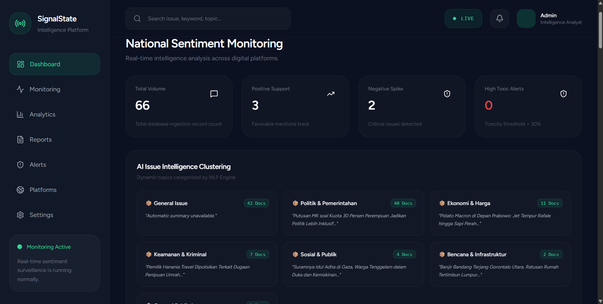
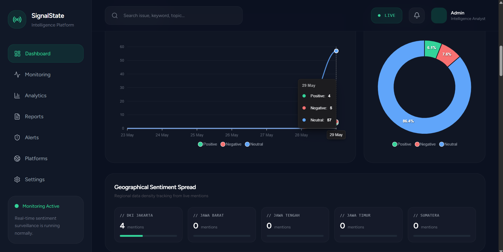
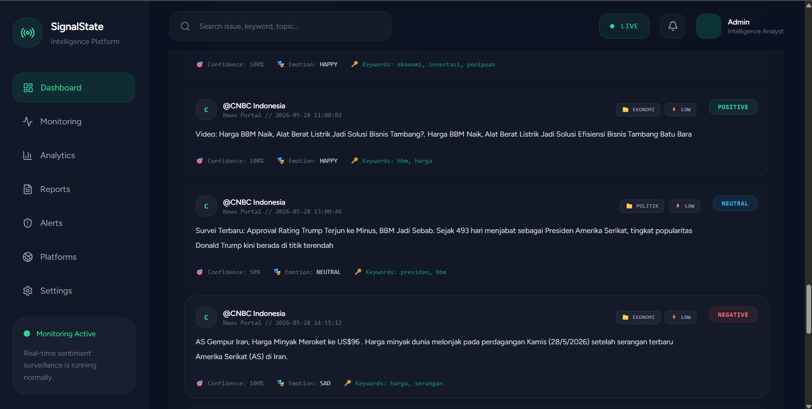

# SignalState

AI-powered public sentiment intelligence & media monitoring platform.

SignalState adalah platform intelligence monitoring yang mengintegrasikan pengumpulan data berita otomatis, analisis NLP berbasis AI, serta dashboard visualisasi real-time untuk memantau opini publik, tren isu, dan sentimen media nasional.

---

## Overview

SignalState dirancang menggunakan arsitektur modular untuk memisahkan proses data ingestion, NLP analytics, dan visualisasi dashboard secara independen.

Platform ini mampu:

- Mengumpulkan berita secara otomatis dari berbagai portal nasional
- Melakukan analisis sentimen dan toksisitas
- Mengelompokkan isu berdasarkan kategori
- Menampilkan monitoring dashboard real-time
- Menghasilkan insight berbasis data media publik

---

## Features

### Real-Time Data Ingestion

- Multi-source RSS aggregation
- Automated scheduled polling
- Duplicate filtering & content cleaning

### NLP Intelligence Engine

- Sentiment analysis
- Toxicity detection
- Issue clustering
- Keyword extraction
- Entity extraction
- Priority classification

### Interactive Dashboard

- Real-time monitoring
- Sentiment analytics
- Live intelligence feed
- Trend visualization
- Issue alerts
- Platform statistics

---

## Tech Stack

### Backend

- Laravel
- REST API
- MySQL

### Frontend

- Vue.js 3
- Inertia.js
- Tailwind CSS
- ApexCharts

### AI / NLP Engine

- FastAPI
- Python 3.10+

---

## System Architecture

```txt
RSS News Sources
        ↓
Data Ingestion Engine
        ↓
Cleaning & Filtering
        ↓
NLP Intelligence Engine
        ↓
Laravel REST API
        ↓
MySQL Database
        ↓
Vue Dashboard Visualization
```

---

## Supported News Sources

Current integrated sources:

- Detikcom
- CNN Indonesia
- Republika
- Antara News
- Kompas
- Tempo
- CNBC Indonesia

---

## Installation

# 1. Clone Repository

```bash
git clone https://github.com/mufaa7/signalstate-platform

cd signalstate
```

---

# 2. Laravel Backend Setup

Install dependencies:

```bash
composer install

npm install
```

Create environment:

```bash
cp .env.example .env
```

Generate application key:

```bash
php artisan key:generate
```

Run database migration:

```bash
php artisan migrate
```

Start Laravel server:

```bash
php artisan serve
```

Run frontend:

```bash
npm run dev
```

---

# 3. NLP Engine Setup

Move into NLP engine folder:

```bash
cd nlp-engine
```

Create virtual environment:

```bash
python -m venv venv
```

Activate environment:

Windows:

```bash
venv\Scripts\activate
```

Install dependencies:

```bash
pip install -r requirements.txt
```

Run FastAPI server:

```bash
uvicorn main:app --host 127.0.0.1 --port 8001 --reload
```

---

# 4. Start News Ingestion Engine

Open new terminal:

```bash
python scraper_news.py
```

---

## Dashboard Modules

### Dashboard

National sentiment monitoring overview.





### Monitoring

Real-time live intelligence feed.

### Analytics

Trend analysis, keyword extraction, and sentiment metrics.

### Alerts

Critical issue & negative sentiment spike detection.

### Reports

Data export & reporting module.

---

## Future Development

Planned improvements:

- WebSocket real-time streaming
- IndoBERT sentiment model
- Topic modeling
- Geographic heatmap
- Social media integration
- AI summarization
- User authentication roles
- PDF intelligence reporting

---

## License

MIT License

---

## Contact

### Muhammad Farhan Fadholi

- Email: [mufarhan022@gmail.com](mailto:mufarhan022@gmail.com)
- Instagram: @mufaa.f
- LinkedIn: Muhammad Farhan Fadholi
